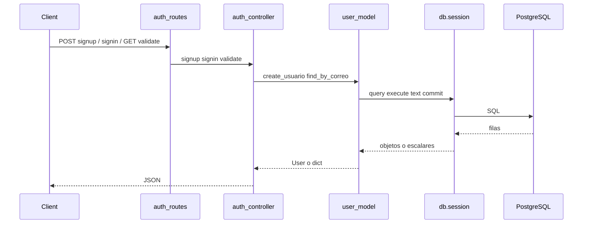

# Base de datos en el módulo de autenticación (Auth)

Documentación **independiente** del README: describe cómo quedó configurada la conexión a PostgreSQL, **los servicios REST de Auth** que usan la base de datos y **cómo el flujo** (`routes` + `controllers` + modelo de usuario) ejecuta consultas. Incluye equivalencias con **JDBC** en Java.

## Alcance del módulo Auth

| Archivo | Función respecto a la BD |
|---------|---------------------------|
| `routes/auth_routes.py` | Expone los tres servicios HTTP: `signup`, `signin`, `validate` → rutas `/api/auth/signup`, `/signin`, `/validate`; no abre conexiones directamente. |
| `controllers/auth_controller.py` | Orquesta reglas HTTP; en errores de persistencia usa `db.session.rollback()`. |
| `models/user_model.py` | Donde realmente se ejecutan consultas e inserciones contra las tablas `usuario` y `rol`. |

La configuración global (`DATABASE_URL`, motor, pool) vive en `config.py` y `app.py`; Auth **no** redefine la URI: solo consume la misma instancia `db` que el resto de la app.

El blueprint se registra en `app.py` con el prefijo **`/api/auth`**, así que todas las rutas públicas del módulo quedan bajo esa URL base.

---

## Servicios REST creados en Auth (los que usan la base de datos)

En este proyecto los “servicios” de autenticación son los **endpoints HTTP** definidos en `routes/auth_routes.py` e implementados en `controllers/auth_controller.py`. No existe una carpeta `services/` aparte: la capa que toca PostgreSQL es `models/user_model.py` más `db.session`.

### Resumen de servicios

| Servicio (nombre lógico) | HTTP | Ruta completa | Handler en rutas | Controlador | ¿Usa BD? |
|--------------------------|------|---------------|------------------|-------------|----------|
| Registro de usuario | `POST` | `/api/auth/signup` | `auth_signup` → `signup()` | `auth_controller.signup` | Sí: inserta en `usuario`, lee `rol` y `usuario` |
| Inicio de sesión | `POST` | `/api/auth/signin` | `auth_signin` → `signin()` | `auth_controller.signin` | Sí: lee `usuario` por correo |
| Validar sesión / token | `GET` | `/api/auth/validate` | `auth_validate` → `validate()` | `auth_controller.validate` | Sí: lee `usuario` y puede leer `rol` al armar la respuesta |

### Detalle por servicio

#### 1. Registro — `POST /api/auth/signup`

- **Entrada JSON típica:** `email`, `password`, `fullName`; opcionales `telefono`, `role` (por defecto rol lógico `"cliente"`).
- **Respuestas:** `201` con datos del usuario (vía `user.to_dict()`), o `400`/`500` con mensaje de error.
- **Uso de base de datos:**
  - `create_usuario` en `user_model.py`.
  - Consultas/operaciones: comprobar correo duplicado (`find_by_correo`), resolver `id_rol` contra tabla `rol` (`resolve_id_rol_db`), calcular siguiente `id_usuario` (`next_usuario_id`), `INSERT` vía ORM (`add` + `commit`).
- **Transacciones:** ante `IntegrityError` u otro error de persistencia, el controlador hace `db.session.rollback()`.

#### 2. Inicio de sesión — `POST /api/auth/signin`

- **Entrada JSON:** `email`, `password`.
- **Respuestas:** `200` con `user.to_dict()` si las credenciales coinciden, `401` si no hay usuario o la contraseña no coincide, `400` si faltan campos.
- **Uso de base de datos:**
  - `find_by_correo(email)` → `SELECT` equivalente sobre `usuario`.
  - La validación de contraseña es en aplicación (comparación en Python), no con SQL.

#### 3. Validación — `GET /api/auth/validate`

- **Cabecera:** `Authorization: Bearer <token>` (token en base64 con forma `correo:timestamp` según el controlador).
- **Respuestas:** `200` con `ok`, `correo` e `id_rol` (nombre del rol desde BD cuando aplica), o `401` si el token o el usuario no son válidos.
- **Uso de base de datos:**
  - `find_by_correo` sobre `usuario`.
  - Al construir la respuesta, `user.to_dict()` puede ejecutar SQL contra `rol` en `_nombre_rol()` para devolver el nombre del rol en lugar del solo número.

### Funciones de `user_model` que actúan como capa de datos para Auth

| Función | Usada desde | Tablas / operación |
|---------|-------------|--------------------|
| `create_usuario` | `signup` | `usuario` (insert), `rol` (select), `usuario` (max id + select por correo) |
| `find_by_correo` | `signup` (antes de insert), `signin`, `validate` | `usuario` (select por correo) |
| `resolve_id_rol_db` | dentro de `create_usuario` | `rol` (select por nombre) |
| `next_usuario_id` | dentro de `create_usuario` | `usuario` (agregado `MAX`) |
| `User.to_dict` / `_nombre_rol` | respuestas de signup, signin, validate | `rol` (select opcional por `id_rol`) |

Las funciones `list_all`, `update_usuario`, `delete_usuario`, etc., pertenecen al mismo modelo pero las consume el módulo de **usuarios** (`/api/users`), no las rutas de `auth_routes.py`.

---

## 1. Configuración previa (requisito para que Auth use la BD)

Sin esto, la aplicación no arranca o Auth no puede persistir usuarios.

### 1.1 Cadena de conexión (`config.py`)

- Se lee `DATABASE_URL` del entorno (con `python-dotenv` en local).
- Se normaliza `postgres://` → `postgresql://` y se fuerza el driver **psycopg v3** con el prefijo `postgresql+psycopg://` en la URL.

**Analogía JDBC:** definir la URL `jdbc:postgresql://...` y la clase del driver antes de obtener conexiones.

### 1.2 Motor y extensión (`app.py` + `db.py`)

- `app.config["SQLALCHEMY_DATABASE_URI"]` recibe la URL ya procesada.
- `SQLALCHEMY_ENGINE_OPTIONS` incluye `pool_pre_ping: True` (comprueba conexiones del pool antes de usarlas).
- `db = SQLAlchemy()` en `db.py` y `db.init_app(app)` enlazan Flask con SQLAlchemy.

**Analogía JDBC:** un `DataSource` con pool y validación de conexiones (por ejemplo HikariCP con `connectionTestQuery` o equivalente).

### 1.3 Tablas y catálogo de roles

- `db.create_all()` crea tablas según modelos ORM (incluye `usuario` vía `User`).
- `seed_db.ensure_seed_data()` puede poblar la tabla `rol` si está vacía. Eso importa para **signup**: el rol enviado por el cliente (por ejemplo `"cliente"`) se resuelve a `id_rol` consultando `rol`.

**Analogía JDBC:** ejecutar DDL o migraciones y datos iniciales antes de que el módulo de registro inserte filas con claves foráneas lógicas.

---

## 2. Flujo Auth y uso de la base de datos

### 2.1 Registro (`POST /api/auth/signup`)

1. `auth_controller.signup` valida `email`, `password`, `fullName`.
2. Llama a `create_usuario(...)` en `user_model.py`.
3. Dentro de `create_usuario`:
   - `find_by_correo` → **ORM:** `User.query.filter_by(correo=correo).first()` (equivalente a un `SELECT` por correo con JDBC + mapeo a objeto).
   - `resolve_id_rol_db` → **SQL parametrizado:** `text("SELECT id_rol FROM rol WHERE ...")` con parámetro `:n` (equivalente a `PreparedStatement`).
   - `next_usuario_id` → **SQL:** `SELECT COALESCE(MAX(id_usuario), 0) + 1 FROM usuario`.
   - Se construye `User(...)`, luego `db.session.add`, `commit`, `refresh`.

4. Si PostgreSQL rechaza la fila (por ejemplo violación de `UNIQUE` en `correo`), `auth_controller` captura `IntegrityError` y ejecuta **`db.session.rollback()`**, igual que **`Connection.rollback()`** en JDBC antes de responder error al cliente.

**Analogía JDBC resumida:** transacción con `INSERT`, manejo de excepción de integridad y rollback explícito.

### 2.2 Inicio de sesión (`POST /api/auth/signin`)

1. `signin` llama `find_by_correo(data["email"])`.
2. Eso ejecuta otra vez `User.query.filter_by(correo=correo).first()` contra la tabla `usuario`.
3. La comprobación de contraseña es en memoria sobre el objeto cargado (`user.contrasena != password`); no implica SQL adicional.

**Analogía JDBC:** un `SELECT` que devuelve una fila y luego lógica en Java sobre el resultado.

### 2.3 Validación de token (`GET /api/auth/validate`)

1. Se decodifica el `Bearer` en el controlador.
2. Se obtiene el correo del payload y se llama otra vez `find_by_correo` → misma consulta ORM a `usuario`.
3. `user.to_dict()` puede disparar una consulta adicional a `rol` vía `_nombre_rol()` (`text("SELECT nombre FROM rol WHERE id_rol = :i")`) para devolver el nombre del rol en la respuesta.

**Analogía JDBC:** uno o dos `PreparedStatement` encadenados según qué campos se necesiten en la respuesta.

---

## 3. Tabla rápida JDBC ↔ código Auth

| JDBC (Java) | En Auth / `user_model` |
|-------------|-------------------------|
| `DataSource.getConnection()` | Conexión del pool gestionada por Flask-SQLAlchemy al usar `db.session` |
| `PreparedStatement` con `?` o nombres | `sqlalchemy.text("... :n ...")` + diccionario en `session.execute` |
| `SELECT ... WHERE correo = ?` | `User.query.filter_by(correo=correo).first()` |
| `INSERT` + `commit` | `session.add(user)` + `session.commit()` |
| `rollback()` en `catch` | `db.session.rollback()` en `auth_controller` ante `IntegrityError` u otras excepciones |

---

## 4. Buenas prácticas ya aplicadas en este módulo

- **Parámetros enlazados** en SQL crudo (`:n`, `:i`), no concatenación de strings con entrada del usuario.
- **Una instancia `db`** importada desde `db.py` (coherente con `app.py`).
- **Rollback** en el controlador cuando la sesión puede quedar en estado de error tras un fallo de BD.

---

## 5. Dependencias directas para Auth + PostgreSQL

- `Flask-SQLAlchemy` — sesión y ORM ligados a la petición Flask.
- `psycopg[binary]` — driver usado en la URL `postgresql+psycopg://` (definida vía `config.py`).

Este documento describe la relación **Auth ↔ base de datos**, los **servicios REST** del módulo (`/api/auth/signup`, `signin`, `validate`) y las funciones de `user_model` que esos servicios utilizan. El resto de la configuración del proyecto está en los archivos fuente: `config.py`, `app.py`, `db.py`, `seed_db.py`, `routes/auth_routes.py`, `controllers/auth_controller.py`, `models/user_model.py`.
